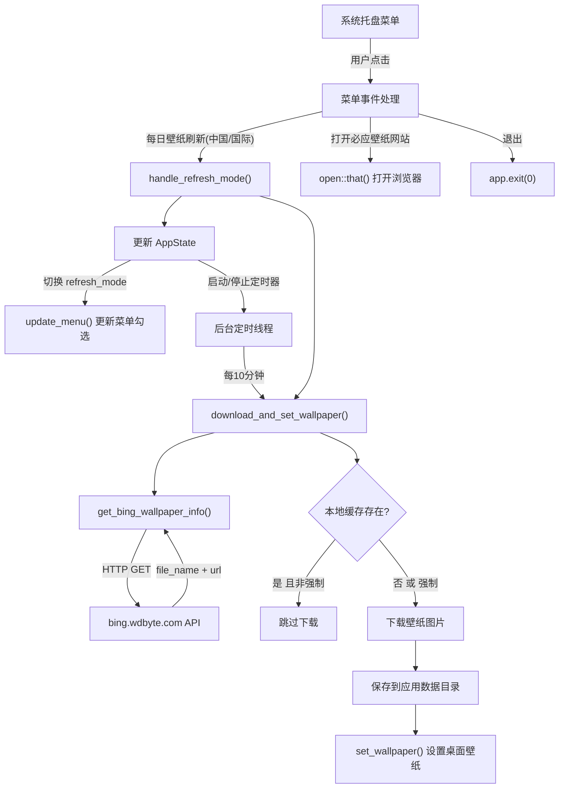

# Bing Wallpaper Client 项目说明文档

## 1. 项目简介

**Bing Wallpaper** 是一个基于 Tauri 2.0 + Rust 开发的桌面系统托盘应用，自动从 [bing.wdbyte.com](https://bing.wdbyte.com) 获取每日必应壁纸并设置为桌面壁纸。

- **应用名称**: Bing Wallpaper
- **应用标识符**: `com.wdbyte.bing.app`
- **版本**: 0.1.0
- **作者**: [github/niumoo](https://github.com/niumoo)

应用没有可视窗口和前端 UI，所有逻辑集中在 Rust 后端，通过系统托盘菜单进行交互。

## 2. 技术栈

| 技术 / 依赖 | 版本 | 用途 |
|---|---|---|
| **Tauri** | 2.0.0 | 桌面应用框架，提供托盘图标和菜单能力 |
| **Rust** | 2021 edition | 核心业务逻辑 |
| **minreq** | 2.11 | 轻量级 HTTP 客户端（支持 HTTPS） |
| **serde / serde_json** | 1.0 | JSON 序列化与反序列化 |
| **uuid** | 1.4.1 | 设备唯一标识（UUID v4）生成 |
| **open** | 3.2 | 在系统默认浏览器中打开 URL |
| **winapi** | 0.3 | Windows 平台壁纸设置 API |
| **log** | 0.4 | 日志输出 |
| **tauri-plugin-opener** | 2 | Tauri 插件，用于打开外部链接 |

## 3. 项目结构

```
bing-wallpaper-client/
├── README.md                        # 运行说明
├── doc.md                           # 项目说明文档（本文件）
├── app-icon.svg                     # 应用图标（SVG 源文件）
├── app-icon.png                     # 应用图标（PNG）
├── .github/
│   └── workflows/
│       └── main.yml                 # GitHub Actions 自动构建与发布
└── src-tauri/                       # Tauri 应用目录（全部源码）
    ├── Cargo.toml                   # Rust 依赖与构建配置
    ├── tauri.conf.json              # Tauri 应用配置
    ├── build.rs                     # Tauri 构建脚本
    ├── capabilities/
    │   └── default.json             # Tauri 权限声明（core、opener）
    ├── icons/                       # 各平台应用图标
    │   ├── 32x32.png
    │   ├── 128x128.png
    │   ├── 128x128@2x.png
    │   ├── icon.icns                # macOS
    │   ├── icon.ico                 # Windows
    │   ├── android/                 # Android 启动图标
    │   └── ios/                     # iOS 应用图标
    └── src/
        ├── main.rs                  # 程序入口，调用 lib::run()
        └── lib.rs                   # 核心应用逻辑（约 365 行）
```

**关键文件说明**：

- `src-tauri/src/lib.rs` — 应用的全部业务逻辑，包括 API 调用、壁纸下载与设置、托盘菜单、定时器、状态管理。
- `src-tauri/src/main.rs` — 仅作为二进制入口，委托给 `lib.rs` 中的 `run()` 函数。
- `src-tauri/tauri.conf.json` — 配置了一个不可见窗口（0x0 像素、透明、无装饰），使应用以纯托盘模式运行。
- `src-tauri/Cargo.toml` — Release 构建启用了 LTO、strip、`opt-level = "s"` 以优化产物体积。

## 4. 核心功能

### 4.1 壁纸获取

通过 HTTP GET 请求从 API 获取当日壁纸元信息：

- **中国区**: `https://bing.wdbyte.com/zh-cn/today`
- **国际区**: `https://bing.wdbyte.com/today`

请求携带以下自定义 Header：
- `client-version: 0.1.0`
- `client-device-uuid: <设备UUID>`

API 返回 JSON 格式：

```json
{
  "file_name": "壁纸文件名.jpg",
  "url": "壁纸下载地址"
}
```

### 4.2 壁纸下载与设置

`download_and_set_wallpaper(force, is_china)` 为核心流程函数：

1. 调用 API 获取壁纸元信息
2. 检查本地缓存，若已存在且非强制模式则跳过下载
3. 下载壁纸图片并保存到应用数据目录
4. 调用平台特定方法设置桌面壁纸

### 4.3 定时刷新

选择刷新模式后，立即执行一次壁纸下载与设置，随后启动后台线程每 **10 分钟**（`REFRESH_INTERVAL = 600` 秒）自动刷新。切换模式或关闭刷新时，通过 `AtomicBool` 标志通知线程停止。

### 4.4 系统托盘菜单

应用在系统托盘显示图标，提供以下菜单项：

| 菜单项 | 功能 |
|---|---|
| 每日壁纸刷新(中国) | 切换中国区壁纸自动刷新，激活时显示 ✓ |
| 每日壁纸刷新(国际) | 切换国际区壁纸自动刷新，激活时显示 ✓ |
| 打开必应壁纸网站 | 在浏览器打开 `https://bing.wdbyte.com` |
| 退出 | 关闭应用 |

两种刷新模式互斥，选择其一时另一个自动关闭；再次点击已激活的模式则取消刷新。

### 4.5 缓存机制

壁纸图片下载后保存在应用数据目录中。定时刷新时会先检查文件是否已存在，已缓存的壁纸不会重复下载，减少网络请求。强制刷新（用户主动切换模式）时会忽略缓存重新下载并设置。

### 4.6 设备标识

首次运行时生成 UUID v4 并写入 `device_uuid.txt`，后续启动直接读取。UUID 随 API 请求发送，用于设备标识。

## 5. 架构与数据流



## 6. 状态管理

应用通过 `Mutex<AppState>` 管理全局状态，由 Tauri 的 `manage()` 方法注入：

```rust
struct AppState {
    refresh_mode: RefreshMode,       // 当前刷新模式
    timer_handle: Option<(JoinHandle<()>, Arc<AtomicBool>)>,  // 定时器线程句柄与取消标志
}

enum RefreshMode {
    DailyChina,   // 中国区每日壁纸
    DailyGlobal,  // 国际区每日壁纸
    None,         // 未启用刷新
}
```

- 所有菜单事件回调通过 `app.state::<Mutex<AppState>>()` 获取状态
- 切换模式时先停止当前定时器（设置 `AtomicBool` 为 `false`），再按需启动新线程
- 菜单文本动态更新以反映当前模式

## 7. 数据存储

应用数据存储在以下目录：

| 平台 | 路径 |
|---|---|
| macOS / Linux | `~/.bing-wallpaper-client/` |
| Windows | `%APPDATA%\bing-wallpaper-client\` |

目录内容：

| 文件 | 说明 |
|---|---|
| `device_uuid.txt` | 设备唯一标识 |
| `*.jpg` 等图片文件 | 已下载的壁纸缓存 |

目录在首次访问时自动创建。

## 8. 平台支持

| 平台 | 壁纸设置 | 实现方式 | 备注 |
|---|---|---|---|
| **macOS** | 支持 | AppleScript (`osascript`) 调用 System Events | 设置 `ActivationPolicy::Accessory` 隐藏 Dock 图标 |
| **Windows** | 支持 | WinAPI `SystemParametersInfoA` (`SPI_SETDESKWALLPAPER`) | 使用 `winapi` crate，条件编译 |
| **Linux** | 仅构建 | 未实现壁纸设置逻辑 | CI 中包含 Ubuntu 构建，但运行时不设置壁纸 |

壁纸设置函数通过 `#[cfg(target_os = "...")]` 条件编译实现平台适配。

## 9. 构建与运行

### 开发环境

```shell
# 安装 Tauri CLI
cargo install tauri-cli

# 开发模式运行
cargo tauri dev
```

### 生产构建

```shell
cargo tauri build
```

### Release 优化配置

`Cargo.toml` 中的 Release profile 配置：

| 选项 | 值 | 作用 |
|---|---|---|
| `panic` | `"abort"` | 移除 panic 清理逻辑，减小体积 |
| `codegen-units` | `1` | 单编译单元，优化更充分 |
| `lto` | `true` | 启用链接时优化 |
| `opt-level` | `"s"` | 优化产物体积 |
| `strip` | `true` | 移除调试符号 |

## 10. CI/CD

项目使用 GitHub Actions 进行自动构建与发布，配置文件为 `.github/workflows/main.yml`。

### 触发条件

- 推送 `v*` 格式的 Git 标签
- 手动触发（`workflow_dispatch`）

### 构建矩阵

| 平台 | 运行环境 | 构建参数 |
|---|---|---|
| macOS (ARM) | `macos-latest` | `--target aarch64-apple-darwin` |
| macOS (Intel) | `macos-latest` | `--target x86_64-apple-darwin` |
| Ubuntu | `ubuntu-22.04` | — |
| Windows | `windows-latest` | — |

### 构建流程

1. 检出代码
2. 安装平台依赖（Ubuntu: GTK、WebKit 等；Windows: WiX Toolset）
3. 配置 Rust 工具链（stable）
4. Rust 编译缓存
5. 使用 `tauri-apps/tauri-action` 构建并创建 GitHub Release（草稿）

### 发布产物

构建完成后自动创建 GitHub Release 草稿，Release 名称格式为 `bing-wallpaper-client v{版本号}`，包含各平台安装包。
